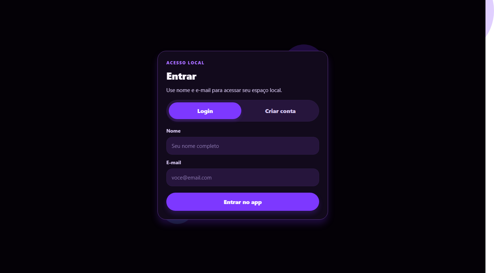
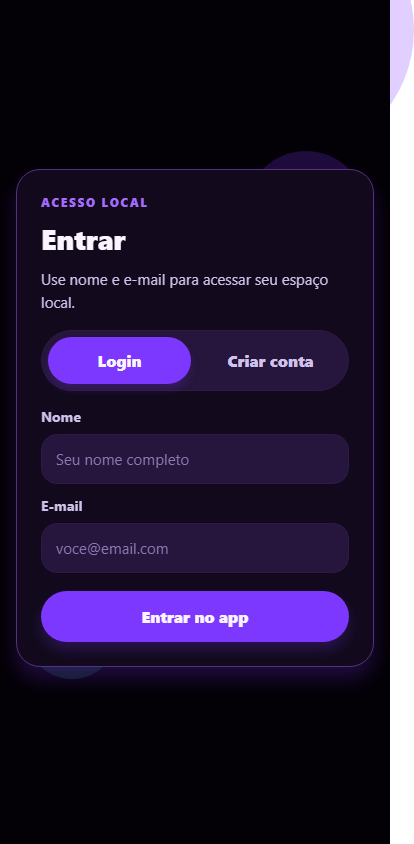

# Tarefas Agora

## Descricao

Aplicativo mobile minimalista para organizar tarefas, perfil local, resumo de produtividade e notificacoes de vencimento.

## Demonstracao Visual

| Desktop | Mobile |
| --- | --- |
|  |  |

## Funcionalidades

- Cadastro de perfil local
- Criacao, edicao, conclusao e exclusao de tarefas
- Categorias e datas de vencimento
- Resumo de tarefas pendentes, concluidas e atrasadas
- Notificacoes locais
- Interface mobile dark e responsiva

## Tecnologias

- Expo
- React Native
- AsyncStorage
- expo-notifications
- lucide-react-native

## Estrutura

- `.gitignore`
- `.nvmrc`
- `App.js`
- `README.md`
- `app.json`
- `babel.config.js`
- `docs/`
- `package-lock.json`
- `package.json`
- `src/`

## Requisitos

- Node.js 18 ou superior
- npm
- Expo CLI via npx
- Expo Go opcional para dispositivo fisico

## Instalacao

- npm install

## Variaveis de Ambiente

- Nao utiliza variaveis de ambiente.

## Comandos Disponiveis

| Acao | Comando |
| --- | --- |
| Iniciar | `npm start` |
| Web | `npm run web` |
| Android | `npm run android` |
| iOS | `npm run ios` |

## Execucao

Execute npm start e abra no Expo Go, emulador ou web quando disponivel.

## Build

Use EAS Build ou expo export conforme o alvo de publicacao.

## Observacoes

- Notificacoes dependem das permissoes e suporte do ambiente de execucao.

## Autor

Maxsuel Oliveira

## Licenca

Este projeto esta licenciado sob a licenca MIT.
